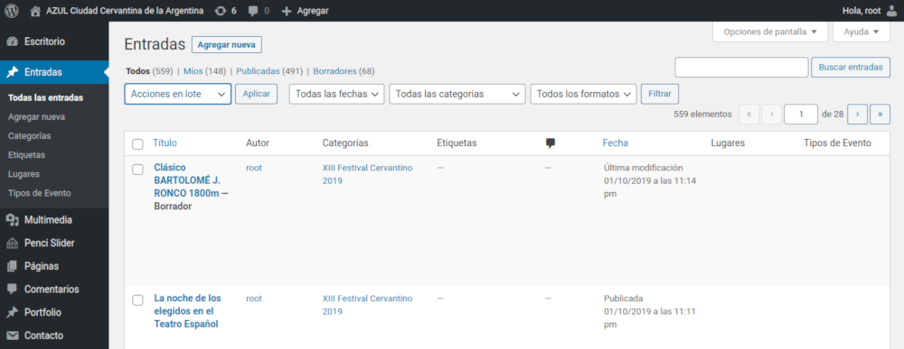
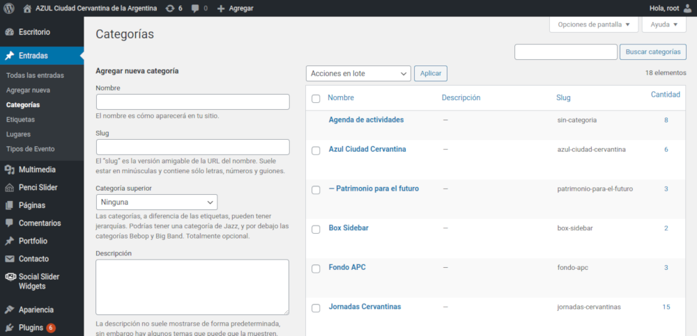

# Artículos y noticias 

#### Resumen

1.  [Visión general](#vision-general)
2.  [Listado y gestión de contenidos](#listado-gestion-contenidos)
3.  [Categorías](#categorias)

---

## Visión general

Todos los contenidos del sitio Web, noticias, eventos, etc. son definidos como **entradas**. Mediante el mismo menú también es posible gestionar:

-   Categorías
-   Etiquetas
-   Lugares
-   Tipos de eventos

> Las **categorías** definen el lugar donde las publicaciones son visualizadas. También pueden indicar el cómo serán visualizadas.

> **Lugares** y **tipos de eventos** son datos relevantes únicamente para la carga de eventos dentro del marco del Festival Cervantino.

## Listado y gestión de contenidos

> Acceso: **Menú lateral** / **Entradas**

Lista todas las entradas (también conocidas como publicaciones o artículos). Puede utilizar filtros para reducir la cantidad de elementos a visualizar: fechas, categorías, formatos.

Si selecciona una o más entradas podrá utilizar el menú **Acciones por lote** para editar un grupo, eliminarlas (moverlas a la papelera) o incluso clonarlas.

Para editar una entrada puede hacer clic sobre el nombre de la misma, o utilizar una de las opciones que se visualizarán al detener el mouse sobre ella. 

## Categorías

> Acceso: **Menú lateral** / **Entradas** / **Categorías**

Las categorías definen ubicaciones dentro del sitio Web donde las entradas podrán visualizarse. Algunas de esas ubicaciones pueden visualizar de forma diferente sus entradas.

Puede crear una nueva categorías simplemente escribiendo su nombre. El **slug** es la versión amigable en la dirección Web del nombre. Suele estar en minúsculas y contiene sólo letras, números y guiones. Deje en blanco este campo para que se genere automáticamente según el nombre de la nueva categoría.

Si en realidad lo que está cargando es una subcategoría de otra, puede indicar su categorías "padre" o principal desde la lista **Categoría superior**.

Por último puede agregar una descripción. Este sitio no la utiliza pero puede servir para indicar obervaciones o recordatorios.

Así como con las entradas, puede seleccionar una o más categorías y luego aplicar una de las opciones del menú **Acciones por lote**.

Puede editar una categoría haciendo clic sobre el nombre de la misma, o utilizar una de las opciones que se visualizarán al detener el mouse sobre ella.

> Todo el funcionamiento descripto para la gestión de categorías es muy similar para las etiquetas, los lugares y tipos de evento. Por esta razón serán omitidas de esta ayuda.

---

[Regresar al inicio](index.md)

---

Última actualización: **24/10/2020**. Desarrollado por **[Pragmática](http://pragmatica.com.ar)**.

