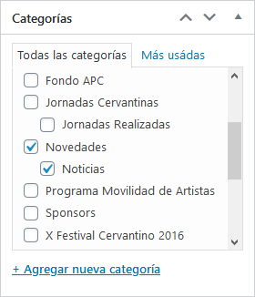
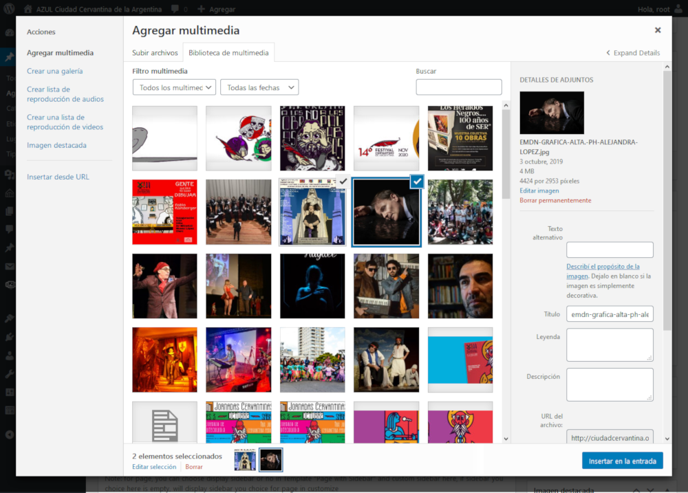
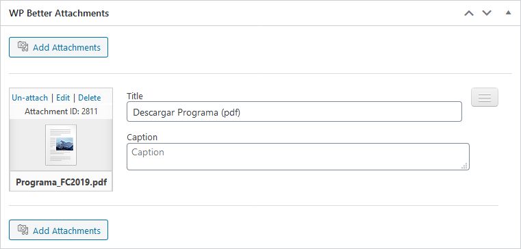

# Artículos y noticias

#### Resumen

1.  [Visión general](#vision-general)
2.  [Listado y gestión de contenidos](#listado-gestion-contenidos)
3.  [Agregar o modificar](#agregar-modificar)
    1.  [Imágenes](#multimedia)
    2.  [Adjuntar archivos](#adjuntar-archivos)
    3.  [Publicar](#publicar)
4.  [Categorías](#categorias)

---

## Visión general

Todos los contenidos del sitio Web, noticias, eventos, etc. son definidos como **entradas**. Mediante el mismo menú también es posible gestionar:

-   Categorías
-   Etiquetas
-   Lugares
-   Tipos de eventos

> Las **categorías** definen el lugar donde las publicaciones son visualizadas. También pueden indicar el cómo serán visualizadas.

> **Lugares** y **tipos de eventos** son datos relevantes únicamente para la carga de eventos dentro del marco del Festival Cervantino.

## Listado y gestión de contenidos

> Acceso: **Menú lateral** / **Entradas**

Lista todas las entradas (también conocidas como publicaciones o artículos). Puede utilizar filtros para reducir la cantidad de elementos a visualizar: fechas, categorías, formatos.

Si selecciona una o más entradas podrá utilizar el menú **Acciones por lote** para editar un grupo, eliminarlas (moverlas a la papelera) o incluso clonarlas.

Para editar una entrada puede hacer clic sobre el nombre de la misma, o utilizar una de las opciones que se visualizarán al detener el mouse sobre ella.

## Agregar o modificar

> Acceso: **Menú lateral** / **Entradas** / **Agregar nueva**

Esta documentación le servirá tanto para la carga como para la edición de noticias, artículos y eventos.

De forma predeterminada, los datos solicitados en la pantalla son los necesarios para registrar un nuevo evento dentro del **Festival Cervantino**. Los campos a completar se ajustarán automaticamente con solo seleccionar una categoría de la lista (ubicada en la columna dercha).

> Recuerde que es **necesario y obligatorio** seleccionar al menos una categoría para cualquier tipo de contenido que desee publicar.

#### Agregando noticias, artículos, etc.

En este tipo de entradas los datos necesarios son:

-   Título
-   Texto de la entrada.
-   Una imagen destacada (preferentemente).

#### Agregando eventos del Festival Cervantino

Si selecciona de la lista de categorías una con la referencia al **Festival Cervantino** del año en curso, podrá notar como los campos del formulario cambian para permitir agregar un evento de este tipo.

Todos los eventos deben tener al menos los siguientes datos:

-   Fecha
-   Hora (no es obligatorio pero de ser posible debe incluirse)
-   Lugar (seleccionado de una lista)
-   Tipo (seleccionado de una lista)

En la medida de lo posible incluya una imagen destacada. El resto de la información solicitada es igual a cualquier otra entrada.

### Imágenes

Puede utilizar el botón **Agregar objeto** para insertar una o más imágenes dentro del texto de la entrada.

> Mantenga presionada la tecla **CTRL** para seleccionar más de una imagen. Haga clic en la solapa **Subir archivos** para incorporar a la biblioteca multimedia aquellas imágenes que tenga en su computadora.

### Adjuntar archivos

Si fuese necesario adjuntar archivos a la entrada (PDF, documentos, etc.) puede utilizar el apartado **WP Better Attachments** disponible dentro del mismo formulario.

> Utilice el botón **Add Attachments** para subir y/o seleccionar los archivos. Puede desvincular un archivo haciendo clic en **Un-attach**. También es posible eliminar definitivamente el archivo cliqueando sobre la opción **Delete**.

### Publicar

Todas las entradas pueden guardarse como borrador. De esta manera el contenido no será publicado y podrá editarlo en cualquier otro momento.

Puede utilizar también el botón **Vista previa** para conocer cómo se terminará visualizando el contenido.

Si fuera necesario puede editar la fecha en que este contenido deberá publicarse. De esta forma los usuarios no verán esta publicación hasta ese momento.

## Categorías

> Acceso: **Menú lateral** / **Entradas** / **Categorías**

Las categorías definen ubicaciones dentro del sitio Web donde las entradas podrán visualizarse. Algunas de esas ubicaciones pueden visualizar de forma diferente sus entradas.

Puede crear una nueva categorías simplemente escribiendo su nombre. El **slug** es la versión amigable en la dirección Web del nombre. Suele estar en minúsculas y contiene sólo letras, números y guiones. Deje en blanco este campo para que se genere automáticamente según el nombre de la nueva categoría.

Si en realidad lo que está cargando es una subcategoría de otra, puede indicar su categorías "padre" o principal desde la lista **Categoría superior**.

Por último puede agregar una descripción. Este sitio no la utiliza pero puede servir para indicar obervaciones o recordatorios.

Así como con las entradas, puede seleccionar una o más categorías y luego aplicar una de las opciones del menú **Acciones por lote**.

Puede editar una categoría haciendo clic sobre el nombre de la misma, o utilizar una de las opciones que se visualizarán al detener el mouse sobre ella.

> Todo el funcionamiento descripto para la gestión de categorías es muy similar para las etiquetas, los lugares y tipos de evento. Por esta razón serán omitidas de esta ayuda.

---

[- Regresar al inicio](index.md)

---

Última actualización: **24/10/2020**. Desarrollado por **[Pragmática](http://pragmatica.com.ar)**.
