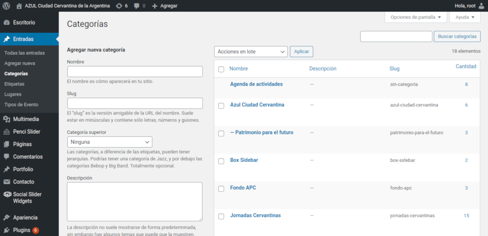

# Categorías y otras tablas auxiliares

#### Resumen

1.  [Visión general](#vision-general)
2.  [Listado y gestión](#listado-gestion)

---

## Visión general

Las categorías definen ubicaciones dentro del sitio Web donde las entradas podrán visualizarse. Algunas de esas ubicaciones pueden visualizar de forma diferente sus entradas.

Forman parte de lo que definimos como **tablas auxiliares** junto con las etiquetas, lugares y tipos de eventos. Todos estos datos adicionales ayudan a que los contenidos del sitio Web se publiquen correctamente.

> Todo el funcionamiento que se describe en esta página para la gestión de las categorías es el mismo para las otras tablas mencionadas. Por esta razón serán omitidas de esta ayuda.

## Listado y gestión

> Acceso: **Menú lateral** / **Entradas** / **Categorías**

Puede crear una nueva categoría simplemente escribiendo su nombre. El **slug** es la versión amigable en la dirección Web del nombre. Suele estar en minúsculas y contiene sólo letras, números y guiones. Deje en blanco este campo para que se genere automáticamente según el nombre ingresado.

Si en realidad lo que está cargando es una subcategoría de otra, puede indicar su categorías "padre" o principal desde la lista **Categoría superior**.

Por último puede agregar una descripción. Este sitio no la utiliza pero puede servir para indicar obervaciones o recordatorios.

Puede seleccionar una o más categorías y aplicar una de las opciones del menú **Acciones por lote**.

Puede editar una categoría haciendo clic sobre el nombre de la misma, o utilizar una de las opciones que se visualizarán al detener el mouse sobre ella.

---

[- Regresar al inicio](index.md)

---

Última actualización: **24/10/2020**. Realizado por **[Pragmática](http://pragmatica.com.ar)**.
