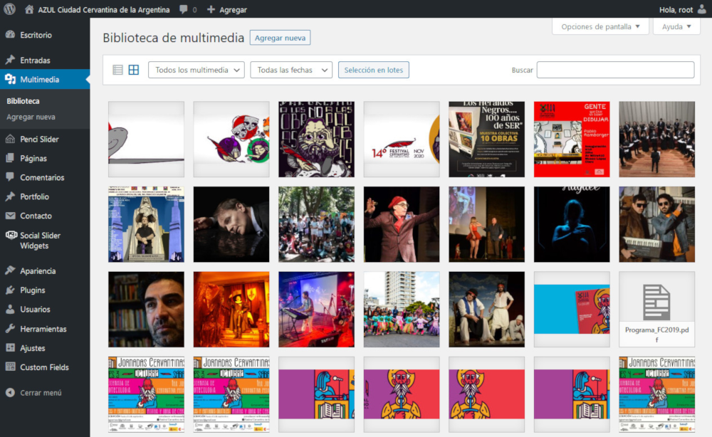
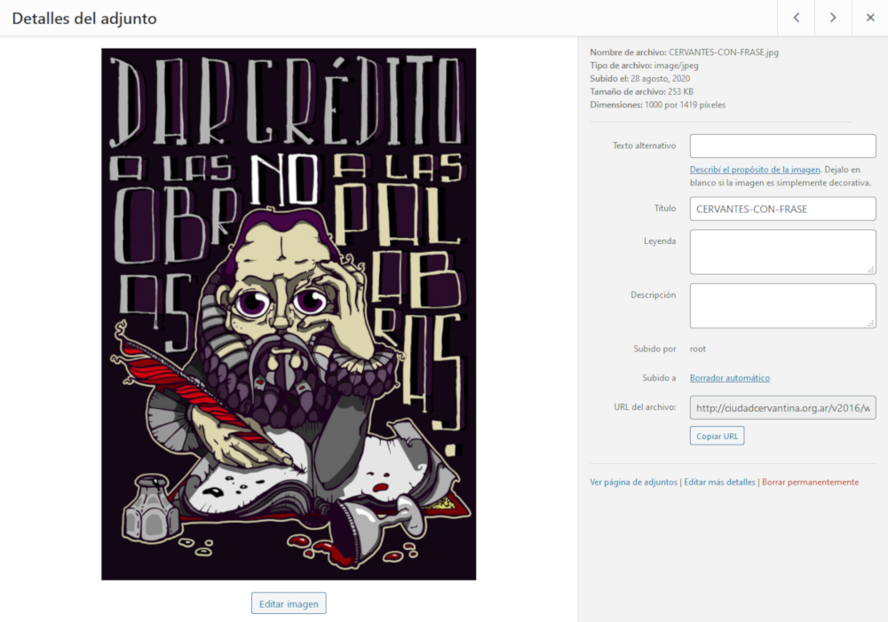
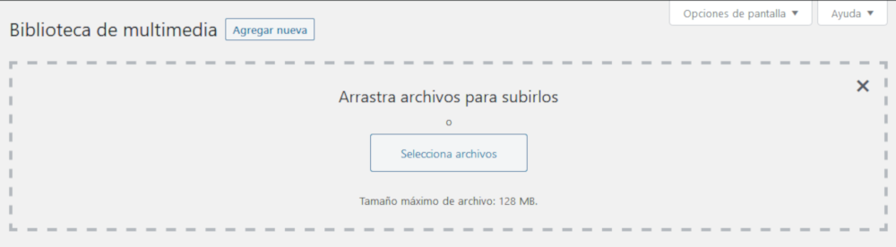

# Recursos multimedia

#### Resumen

1.  [Visión general](#vision-general)
2.  [Listado y gestión de archivos](#listado-gestion-archivos)
3.  [Subir archivos](#subir-archivos)

---

## Visión general

La biblioteca multimedia le permite gestionar todos los archivos utilizados en el sitio Web. Desde las imágenes publicadas hasta los archivos disponibles para que los usuarios puedan descargarlos (PDF, documentos, etc.).

> Revisar periódicamente esta biblioteca es una buena práctica para detectar imágenes y otros archivos duplicados.

## Listado y gestión de archivos

> Acceso: **Menú lateral** / **Multimedia**

En esta pantalla podrá visualizar todos los archivos subidos hasta el momento. Puede reducir la cantidad de elementos a visualizar filtrando por tipos de archivos o fechas.

Utilice el botón **Selección en lotes** para marcar más de un archivo a eliminar definitivamente.

Haga clic sobre un archivo para ver una vista previa del mismo.

Puede editar el **texto alternativo** y **título** utilizados en el resto del sitio.

Haga clic sobre **Borrar permanentemente** para eliminar el archivo físicamente del servidor.

> Recuerde que al eliminar definitivamente un archivo implica deshacer todas las referencias al mismo en los artículos publicados.

Utilice el botón **Editar imagen** para recortar, rotar o voltear la imagen seleccionada.

## Subir archivos

> Acceso: **Menú lateral** / **Multimedia** / **Agregar nueva**

Esta opción le permite agregar archivos a la biblioteca multimedia con el fin de utilizarlos posteriormente.

Puede arrastrar una lista de archivos seleccionados desde su *explorador de archivos*. O seleccionarlos de una carpeta mediante el botón **Selecciona archivos**.

---

[- Regresar al inicio](index.md)

---

Última actualización: **24/10/2020**. Realizado por **[Pragmática](http://pragmatica.com.ar)**.
